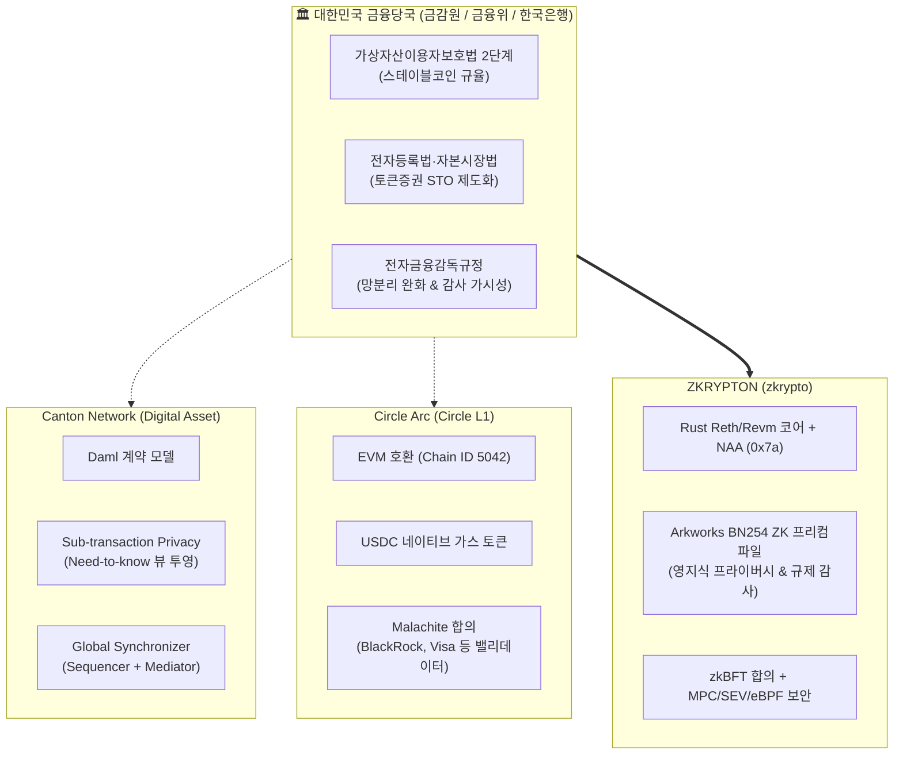

# 🏛️ ZKRYPTON vs Canton Network vs Circle Arc
## 금융당국(금감원·금융위·한은) 관점의 기관용 블록체인 인프라 심층 분석 & 지식베이스

[](https://github.com/snowd-zk/zkrypton_vs/wiki)
[](https://opensource.org/licenses/MIT)
[](https://zkrypto.com)

본 저장소는 **금융감독원, 금융위원회, 한국은행** 등 대한민국 금융당국이 주목하고 있는 글로벌 차세대 기관용 금융 블록체인 인프라(**Canton Network**, **Circle Arc**)의 기술 아키텍처와 규제 준수성을 심층 분석하고, 지크립토(zkrypto)의 차세대 기관용 블록체인 **ZKRYPTON**의 기술적 차별화 및 제도적 포지셔닝 전략을 집대성한 지식베이스입니다.

> 📖 **GitHub Wiki 바로가기**: [https://github.com/snowd-zk/zkrypton_vs/wiki](https://github.com/snowd-zk/zkrypton_vs/wiki)

---

## 📌 배경 및 리서치 목적

2026년 하반기, 글로벌 및 국내 금융권은 단순 PoC 단계를 넘어 **실제 자본시장 및 제도권 통화 인프라의 온체인화(On-Chain Institutional Settlement)** 단계에 본격 진입하였습니다.

1. **글로벌 금융 시장의 지각변동**:
   - **Canton Network (Digital Asset)**: DTCC, Euroclear, BNY Mellon, Goldman Sachs 등 글로벌 초대형 금융기관들이 참여하여 프라이버시 보장과 원장 간 원자적 동시결제(Atomic DvP)를 구현하는 상호운용 금융 네트워크로 부상.
   - **Circle Arc (Circle L1)**: 2026년 9월 메인넷을 공식 출시하며, 휘발성 네이티브 토큰 대신 **USDC를 네이티브 가스 토큰**으로 채택하고 BlackRock, Visa, Mastercard, DTCC 등 초대형 금융 컨소시엄을 밸리데이터로 확보하여 '인터넷의 경제 OS'를 표방.
2. **국내 금융당국(금감원·금융위·한국은행)의 정책적 관심 집중**:
   - **토큰증권(STO)**: 분산원장의 법적 효력 인정, 계좌관리기관 인가 요건, 투자자 보호 및 분산원장 기재 요건 법제화.
   - **스테이블코인 및 예금토큰**: 가상자산이용자보호법 2단계(디지털자산기본법), 원화/외화 스테이블코인 규율체계, 한국은행 CBDC 및 아고라(Agora) 프로젝트 연계.
   - **기관 자본시장 인프라 & 금융 망분리**: 전자금융감독규정 개정에 따른 SaaS·클라우드·블록체인 활용 가이드라인, 결제완결성(채무자회생법 특례) 보장.
3. **ZKRYPTON의 전략적 포지셔닝**:
   - Rust Reth/Revm 고성능 EVM 엔진, zkBFT 합의, 네이티브 계정 추상화(NAA), Arkworks 기반 BN254 영지식 증명(ZKP) 프리컴파일을 탑재한 ZKRYPTON이 글로벌 외산 체인 대비 제공할 수 있는 **프라이버시-컴플라이언스 양립 구조**와 **국내 제도권 최적화 전략** 확립.

---

## 🧭 지식베이스 목차 (Knowledge Base Index)

| 모듈 | 핵심 주제 | 문서 링크 (저장소) | Wiki 링크 |
| :--- | :--- | :--- | :--- |
| **01. Canton Network** | 기관용 프라이버시 상호운용 네트워크 | [`wiki/01_Canton_Network_Deep_Dive.md`](wiki/01_Canton_Network_Deep_Dive.md) | [Wiki 보기](https://github.com/snowd-zk/zkrypton_vs/wiki/01_Canton_Network_Deep_Dive) |
| **02. Circle Arc** | 스테이블코인 네이티브 L1 결제 인프라 | [`wiki/02_Circle_Arc_Chain_Deep_Dive.md`](wiki/02_Circle_Arc_Chain_Deep_Dive.md) | [Wiki 보기](https://github.com/snowd-zk/zkrypton_vs/wiki/02_Circle_Arc_Chain_Deep_Dive) |
| **03. 금융당국 규제 분석** | 금감원·금융위 3대 핵심 의제 분석 | [`wiki/03_Regulatory_Compliance_Analysis.md`](wiki/03_Regulatory_Compliance_Analysis.md) | [Wiki 보기](https://github.com/snowd-zk/zkrypton_vs/wiki/03_Regulatory_Compliance_Analysis) |
| **04. 비교 분석 및 전략** | 4대 축 비교 매트릭스 및 ZKRYPTON 전략 | [`wiki/04_Comparative_Matrix_and_ZKRYPTON_Strategy.md`](wiki/04_Comparative_Matrix_and_ZKRYPTON_Strategy.md) | [Wiki 보기](https://github.com/snowd-zk/zkrypton_vs/wiki/04_Comparative_Matrix_and_ZKRYPTON_Strategy) |

---

## 📊 4대 축 종합 비교 매트릭스

| 비교 축 | 🏛️ Canton Network | 🌐 Circle Arc | 🛡️ ZKRYPTON (zkrypto) |
| :--- | :--- | :--- | :--- |
| **1. 아키텍처 & 합의** | Daml 런타임 (비-EVM)<br>시퀀서+미디에이터 2PC | 완전 EVM (Chain ID 5042)<br>Malachite BFT 합의 | **Rust Reth/Revm 초고성능 EVM**<br>**zkBFT (Stable Leader, 10,000 TPS)** |
| **2. 프라이버시 & 암호학** | Sub-transaction Privacy<br>(Need-to-know 뷰 투영) | 없음 (Public EVM Ledger)<br>모든 계좌 및 거래내역 공개 | **Arkworks BN254 ZK 프리컴파일**<br>**수학적 영지식 증명(ZKP) 기밀성** |
| **3. 가스비 & 계정 모델** | 도메인별 정책 과금<br>Party 기반 모델 | **USDC 네이티브 가스**<br>표준 EOA 모델 | **네이티브 계정 추상화 (NAA 0x7a)**<br>**원화 에스크로 정산 & 가스 대납** |
| **4. 규제 & 컴플라이언스** | 해외 금융사 SV 거버넌스<br>Auditor 노드 감사 | 미 재무부/Circle 단일 종속<br>중앙화 블랙리스트 동결 | **국내 금융 컨소시엄 주권 확보**<br>**ZKP 선택적 규제 증명 (Compliance)** |

---

## 🏗️ 전체 시스템 비교 아키텍처



---

## 🚀 ZKRYPTON의 3대 시장 선점 전략

1. **삼성SDS 협력 기반 은행권 "토큰화 예금(Tokenized Deposit)" 컨소시엄 주도**:
   - 한국은행 CBDC/아고라 프로젝트의 국내 민간 대응망으로서, 삼성SDS 클라우드와 결합하여 국내 금융 망분리 가이드라인을 100% 충족하는 국산 ZK-EVM 코어 포지셔닝.
2. **토큰증권(STO) 계좌관리기관 표준 분산원장 선점**:
   - 증권사·신탁사를 대상으로 투자자 잔고를 ZKP로 보호하면서도, 금융감독원에만 실시간 법적 감사 증명을 제공하는 **선택적 공개(Selective Disclosure) 레퍼런스 아키텍처** 공급.
3. **원화(KRW) 결제 및 엔터프라이즈 가스 대납 인프라 완성**:
   - Arc 체인의 장점(법정화폐 연동 예측 가능 비용)을 흡수하여, ZKRYPTON NAA(Type 0x7a)를 활용한 **"원화 법인계좌 일괄 정산 Paymaster"**를 통해 기업의 가상자산 보유 리스크 완전 제거.

---

## 🛠️ GitHub Wiki 동기화 가이드

본 저장소의 `wiki/` 폴더 내 마크다운 파일들은 GitHub Wiki (`.wiki.git`)와 완벽히 호환되도록 구성되어 있습니다.

```bash
# GitHub Wiki 저장소로 직접 푸시하기
./sync_to_github_wiki.sh
```

---
*© 2026 zkrypto Inc. All Rights Reserved.*