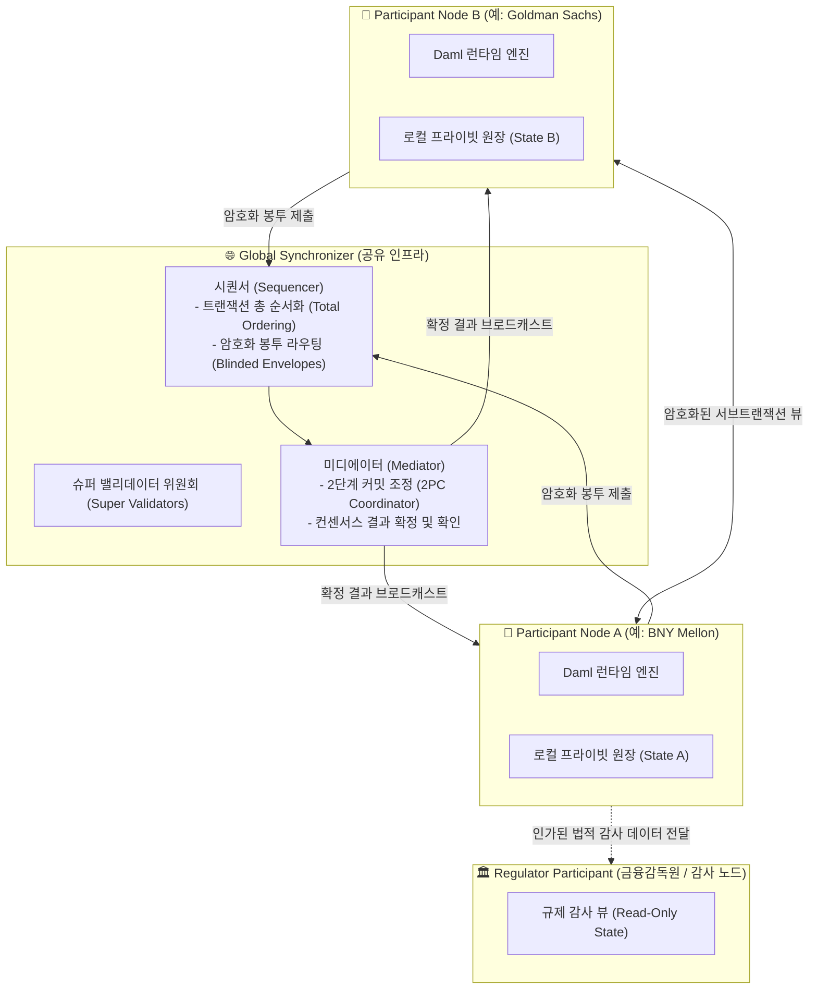

# 🏛️ Canton Network 심층 분석 보고서
## 프라이버시 기반 기관용 상호운용 금융 네트워크

- **조사일자**: 2026-09-29
- **분류**: Enterprise Consortium / Privacy Interoperable Financial Network
- **주요 개발사 및 주관**: Digital Asset Holdings, Canton Network Consortium
- **공식 링크**:
  - 웹사이트: [https://canton.network](https://canton.network)
  - 공식 문서/Docs: [https://docs.daml.com/canton](https://docs.daml.com/canton)
  - 기술 백서: Canton Protocol Whitepaper

---

## 1. 프로젝트 개요 (Executive Summary)

**Canton Network**는 전통 금융기관(Tier-1 Investment Banks, CSD, 청산소, 자산운용사)의 엄격한 규제 준수, 프라이버시 보호, 그리고 상호운용성을 동시에 만족시키기 위해 **Digital Asset**이 개발하고 글로벌 금융 컨소시엄이 운영하는 **분산형 상호운용 금융 네트워크(Network of Networks)**입니다.

기존 퍼블릭 블록체인의 최대 한계점인 **전체 노드 데이터 공개(Public Broadcast)**와 프라이빗 컨소시엄 체인의 한계점인 **고립된 사일로(Siloed Ledgers)** 문제를 해결하기 위해, 스마트 계약 언어인 **Daml**과 **Canton Protocol**을 결합하여 **"서브 트랜잭션 프라이버시(Sub-transaction Privacy)"**와 **"원자적 크로스-도메인 동기화(Atomic Cross-Domain Synchronization)"**를 달성했습니다.

### 🌟 핵심 기관 참여자 및 생태계 현황
Canton Network는 전 세계에서 가장 강력한 제도권 금융기관 풀을 실질적 노드 및 생태계 참여자로 확보하고 있습니다:
- **청산/결제 및 예탁기관**: DTCC (미국 예탁결제원), Euroclear (유럽 청산결제기관)
- **글로벌 투자은행(IB)**: Goldman Sachs, BNY Mellon, BNP Paribas, Standard Chartered
- **거래소 및 시장 인프라**: Cboe Global Markets, Deutsche Börse, Broadridge, Tradeweb
- **디지털 자산 및 스테이블코인**: Circle (USDC 및 USYC 제공), Paxos, Cumberland
- **2024~2026 파일럿 성과**: 155개 이상의 글로벌 금융기관이 참여하여 22개 Daml 분산 애플리케이션(dApp) 간 350건 이상의 원자적 트랜잭션(증권 토큰화, 자금 대차, 24/7 레포 마진 콜, DvP 결제 등) 실증 완료.

---

## 2. 코어 아키텍처 및 프로토콜 메커니즘

Canton Network는 단일 글로벌 공유 상태(Global Monolithic State)를 유지하지 않으며, 각각의 자치적인 서브네트워크(동기화 도메인)들이 표준화된 상호운용 프로토콜을 통해 연결되는 구조를 가집니다.

### A. 프로토콜 구성 요소 (Architectural Components)

1. **참여자 노드 (Participant Node)**:
   - 각 금융기관(은행, 자산운용사, 브로커 등)이 직접 호스팅하는 노드입니다.
   - Daml 엔진을 실행하며, 해당 기관이 서명자(Signatory)이거나 관찰자(Observer)로 지정된 **"알 권리가 있는(Need-to-know)" 계약 데이터만을 로컬 원장에 저장**합니다.
2. **동기화 도메인 (Synchronization Domain)**:
   - 트랜잭션의 순서(Ordering)와 이중 지불 방지(Conflict Detection)를 담당하는 논리적 연결 계층입니다.
   - 도메인은 **시퀀서(Sequencer)**와 **미디에이터(Mediator)**로 구성됩니다.
3. **시퀀서 (Sequencer)**:
   - 참가자 노드로부터 암호화된 메시지 봉투(Blinded Envelopes)를 수신하여 글로벌 타임스탬프를 부여하고 엄격한 순서(Total Ordering)를 매깁니다.
   - **중요**: 시퀀서는 트랜잭션의 비즈니스 로직, 계약 내용, 금액, 참여자 신원을 일절 복호화할 수 없습니다.
4. **미디에이터 (Mediator)**:
   - 2단계 커밋(Two-Phase Commit, 2PC)의 코디네이터 역할을 수행합니다.
   - 트랜잭션에 관련된 당사자 노드들의 유효성 검증 서명(Confirmation)을 수합하여 최종 커밋(Commit) 또는 중단(Abort) 판정을 내립니다.
5. **글로벌 싱크로나이저 (Global Synchronizer)**:
   - 여러 독립적인 동기화 도메인들을 가로질러 글로벌 크로스-도메인 트랜잭션을 중개하는 탈중앙화된 공유 인프라입니다.
   - 유수의 글로벌 기관들로 구성된 **슈퍼 밸리데이터(Super Validators, SV)** 위원회에 의해 탈중앙 거버넌스로 운영됩니다.

---

## 3. 스마트 컨트랙트 및 프라이버시 모델

### A. Daml (Digital Asset Modeling Language)의 권한 모델
Canton Network의 모든 스마트 컨트랙트는 함수형 스마트 계약 언어인 **Daml**로 작성됩니다. Daml은 계약 코드 레벨에서 다음과 같은 주체(Parties) 권한을 강제합니다:
- **Signatories (서명자)**: 계약의 생성 및 변경에 반드시 동의해야 하는 필수 권한 주체 (예: 발행인, 채무자).
- **Controllers / Choice Observers (선택 실행자/관찰자)**: 계약의 특정 조항(Choice)을 실행할 수 있는 주체.
- **Observers (관찰자)**: 계약의 내용을 열람할 정당한 법적 권리를 가진 주체 (예: 수탁사, 감사인).

### B. 서브 트랜잭션 프라이버시 (Sub-transaction Privacy)
기존 블록체인은 트랜잭션 $T$ 전체가 모든 검증인에게 전파되지만, Canton은 트랜잭션을 트리 구조의 하위 뷰(View Projection)로 분해합니다.

$$\text{Transaction } T = \{V_1, V_2, \dots, V_k\}$$

- 참가자 노드 $P_i$는 자신이 이해관계자로 속한 뷰 $V_j$에 대해서만 복호화 키를 가지며, 무관한 하위 뷰에 대해서는 암호학적 해시값(Commitment Hash)만 수신합니다.
- 이를 통해 **"A은행과 B은행 간의 장외파생 계약 체결 시, 담보를 이동시키는 C수탁사는 자신과 관련된 담보 이체 트랜잭션만 볼 수 있고 파생계약의 원금 및 만기 금리는 볼 수 없는 구조"**를 수학적·프로토콜 레벨에서 구현합니다.

---

## 4. 핵심 금융 적용 사례 (Institutional Use Cases)

| 적용 분야 | 기존 금융 시스템의 한계 | Canton Network 적용 효과 |
| :--- | :--- | :--- |
| **원자적 DvP (동시결제)** | 증권 결제망과 자금 결제망의 분리로 인한 시차 리스크(Herstatt Risk) 및 복잡한 에스크로 | 별도의 브릿지나 중앙 에스크로 없이, 서로 다른 도메인에 존재하는 토큰증권(STO)과 예금토큰/USDC 간 단일 원자적 트랜잭션 결제 |
| **24/7 담보 이동성 (Collateral Mobility)** | 은행 영업시간(영업일 09:00~16:00) 외 마진 콜 및 담보 부족 발생 시 청산 위험 | DTCC-BNY Mellon 간 파일럿에서 입증된 바와 같이, 야간/주말 상관없이 실시간 즉시 담보 차환 및 재담보화(Rehypothecation) |
| **토큰화 예금 및 도매 CBDC** | 은행 간 상계 정산 시 중앙은행 RTGS 마감 시간 종속 | 상업은행 간 예금토큰 이체와 중앙은행 도매 CBDC 간 즉시 총액결제(RTGS) 연동 가능 (Project Agora 모델 부합) |
| **Circle USDC 및 USYC 연계** | 제도권 기관들의 온체인 무위험 수익(Treasury Yield) 자산 부족 | Circle이 인수한 Hashnote의 USYC(토큰화 미국 단기국채 펀드) 및 USDC가 Canton 원장에 직접 발행되어 규제 부합형 유동성 공급 |

---

## 5. 금융당국(금감원·금융위) 관점의 규제 및 컴플라이언스 분석

### A. 규제 감독 가시성 (Regulatory Oversight)
- **감사관 노드(Auditor Node) 메커니즘**:
  - 금융감독원이나 한국은행은 Canton Network에 직접 **감사관(Auditor/Regulator) 역할의 Participant Node**로 참여할 수 있습니다.
  - Daml 계약 정의 시 `observer Regulator`를 포함하도록 금융 규제 템플릿을 표준화하면, 당사자들의 거래가 발생할 때마다 감독당국 노드로 암호화된 트랜잭션 뷰가 자동 복호화되어 실시간 전송됩니다.
  - **시사점**: 사후 보고서 제출 방식에서 벗어나 **실시간 온체인 금융 감독(Real-Time Supervisory Technology, SupTech)**이 가능해집니다.

### B. 금융실명제 및 개인정보보호법(잊힐 권리) 적합성
- **Need-to-know 원칙과 원장 분리**: 퍼블릭 체인과 달리 개인식별정보(PII)나 금융거래 상세 내역이 글로벌 블록체인에 영구 브로드캐스트되지 않습니다.
- 해당 거래에 참여하지 않은 제3자는 거래 존재 자체를 알 수 없으므로, **신용정보법 및 금융실명법상 비밀보장 의무**를 자연스럽게 충족합니다.

### C. 결제 완결성 (Settlement Finality)의 법적 인정
- Canton Protocol의 2PC 합의는 확률적 확정성(Probabilistic Finality)이 아닌 **결정론적 완결성(Deterministic Finality)**을 제공합니다.
- 미디에이터가 최종 승인 메시지를 서명한 시점에 법적 결제 완결이 성립하므로, **채무자회생법상 결제완결성 보장 조항**과의 정합성이 매우 높습니다.

---

## 6. 기술적 한계점 및 트레이드오프 (Limitations & Challenges)

1. **EVM 비호환 및 Daml 학습 장벽**:
   - 솔리디티(Solidity) 기반의 광범위한 Web3 개발자 생태계 및 기존 스마트 컨트랙트 자산을 직접 재사용할 수 없으며, Daml 전용 컴파일러 및 런타임을 학습해야 합니다.
2. **복합 크로스-도메인 트랜잭션의 레이턴시**:
   - 2개 이상의 동기화 도메인을 가로지르는 원자적 트랜잭션의 경우, 복수의 미디에이터 및 참여자 간 라운드트립 통신으로 인해 단일 블록체인 대비 지연 시간(Latency)이 1~3초 수준으로 증가할 수 있습니다.
3. **슈퍼 밸리데이터(SV) 위원회의 거버넌스 집중**:
   - 글로벌 싱크로나이저를 운영하는 SV 노드들이 대부분 미국/유럽 대형 금융기관에 집중되어 있어, 국내 금융당국 입장에서는 **주권적 통제권(Sovereign Regulatory Control)** 및 데이터 국외 이전 이슈가 제기될 수 있습니다.

---

## 7. Canton Network vs ZKRYPTON 종합 비교

| 비교 항목 | 🏛️ Canton Network | 🛡️ ZKRYPTON (zkrypto) | 시사점 및 차별화 포인트 |
| :--- | :--- | :--- | :--- |
| **스마트 계약 언어** | Daml (함수형 스마트 계약 전용 언어) | **Solidity 100% 호환 (EVM 표준)** | ZKRYPTON은 기존 Web3 개발 인력 및 컨트랙트 즉시 재활용 가능 |
| **프라이버시 메커니즘** | **Sub-transaction Privacy** (뷰 프로젝션) | **Arkworks BN254 영지식 증명 (ZKP)** | Canton은 계약 분할 방식, ZKRYPTON은 수학적 은닉 및 즉시 검증 |
| **크로스도메인 완결성** | 시퀀서 + 미디에이터 간 다단계 2PC (1~3초) | **zkBFT 단일 엔진 내 즉시 서브세컨드 확정** | ZKRYPTON이 복합 트랜잭션 처리 지연시간(Latency) 대폭 단축 |
| **감사관(감독당국) 연동** | Auditor Participant Node 직접 구축 필수 | **ZKP 기반 선택적 규제 증명 (Selective Disclosure)** | ZKRYPTON은 감독당국의 무거운 풀노드 운영 부담을 영지식 검증기로 대체 |
| **국내 거버넌스 주권** | 글로벌 SV 위원회 의존 (미국/유럽 중심) | **국내 금융기관 및 삼성SDS 중심 컨소시엄** | 데이터 국외 이전 법령 및 국내 전자금융감독규정에 완벽 부합 |
