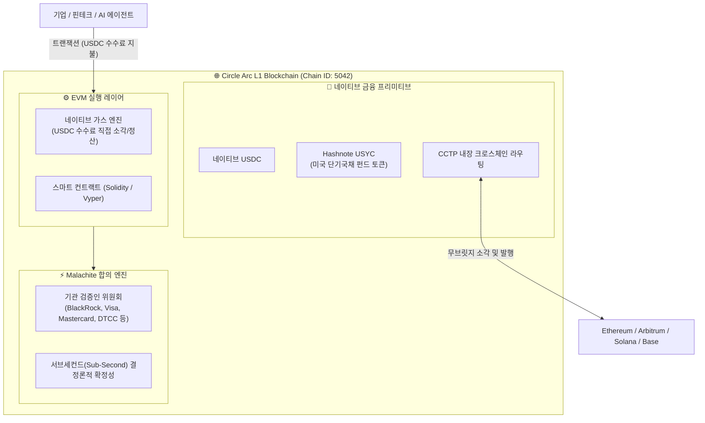

# 🌐 Circle Arc 체인 심층 분석 보고서
## 스테이블코인 네이티브 L1 및 제도권 결제 인프라

- **조사일자**: 2026-09-29
- **분류**: Stablecoin-Native L1 / Institutional Financial Settlement Layer
- **주요 개발사**: Circle Internet Financial (Circle)
- **출시일자**: 2026년 9월 16일 (메인넷 공식 론칭)
- **핵심 기술 스펙**:
  - 체인 식별자 (Chain ID): `5042`
  - 네이티브 가스 토큰: **USDC** (달러 연동 스테이블코인)
  - 합의 엔진: **Malachite** (결정론적 서브세컨드 확정성)
  - 실행 환경: 완전 EVM(Ethereum Virtual Machine) 호환
  - 공식 RPC 엔드포인트: `https://rpc.mainnet.arc.io`

---

## 1. 프로젝트 개요 (Executive Summary)

**Circle Arc**는 글로벌 2위 스테이블코인 USDC의 발행사인 **Circle**이 2026년 9월 16일 전격 출시한 **제도권 금융 및 인터넷 결제 특화 Layer-1 블록체인**입니다.

기존 모든 L1 블록체인이 변동성이 극심한 자체 유틸리티 토큰(ETH, SOL, AVAX 등)을 가스비(수수료)로 요구함으로써 기업 및 금융기관의 회계 처리와 재무 예측을 불가능하게 만들었던 문제를 원천적으로 해결했습니다. Circle Arc는 **세계 최초로 완전한 법정화폐 담보 스테이블코인인 USDC를 네이티브 가스 토큰으로 채택**하여, "모든 트랜잭션 비용이 달러(USD) 단위로 확정·정산되는 예측 가능한 경제 운영체제(Economic OS)"를 구축했습니다.

### 🏛️ 창립 기관 밸리데이터 (Founding Institutional Validators)
Circle Arc는 초기 네트워크의 신뢰성과 제도권 컴플라이언스를 확보하기 위해, 완전 비인가형(Permissionless) 합의 대신 **글로벌 금융 및 결제 대기업 컨소시엄**을 검증인으로 구성했습니다:
- **전통 금융 & 결제 거인**: **BlackRock**, **Visa**, **Mastercard**, **DTCC** (미국 예탁결제원), **Intercontinental Exchange (ICE)**
- **글로벌 뱅킹 & 송금**: **Standard Chartered**, **MoneyGram**, **SBI Group**, **Sumitomo Corporation**
- **디지털 자산 및 인프라**: **Galaxy Digital**, **Global Payments**

---

## 2. 코어 아키텍처 및 합의 메커니즘

### A. USDC 네이티브 가스 모델 (Stablecoin-Native Gas)
- **메커니즘**: 트랜잭션 수수료는 EVM 기저 프로토콜 레벨에서 `10^-6 USDC` (1 마이크로센트 단위)로 계산되며, 별도의 토큰 스왑이나 래핑(Wrapping) 없이 계정의 USDC 잔액에서 직접 차감됩니다.
- **기업 재무 정합성**:
  - 기업 회계 기준에서 암호화폐 보유에 따른 자산 재평가 손익(Mark-to-Market P&L 변동성) 및 법인세 과세 이슈를 원천 배제합니다.
  - API 호출 요금처럼 트랜잭션 건당 $0.001~$0.005 수준의 **고정된 법정화폐 비용(OPEX)**으로 처리 가능합니다.

### B. Malachite 합의 엔진 및 서브세컨드 확정성
- **결정론적 완결성**: 블록 재구성(Reorganization) 리스크가 없는 BFT 계열의 고성능 합의 알고리즘을 적용하여 **1초 미만(Sub-second)의 즉시 결제 완결성**을 보장합니다.
- **처리량**: 비자(Visa) 및 마스터카드(Mastercard)의 결제 처리망 요구사항을 충족하기 위해 수천 TPS 이상의 실시간 병렬 실행을 지원합니다.

### C. 내장 금융 프리미티브 (Built-in Primitives)
1. **CCTP (Cross-Chain Transfer Protocol) 네이티브 통합**:
   - 외부 블록체인(이더리움, 솔라나, 아비트럼 등) 간에 랩드 토큰(Wrapped Token) 없이 네이티브 USDC를 1:1로 소각·발행(Burn & Mint)하여 즉시 이전할 수 있습니다.
2. **Hashnote 인수 및 USYC (Tokenized T-Bill) 네이티브 지원**:
   - Circle이 인수한 Hashnote의 **USYC(미국 단기 국채 기반 머니마켓 펀드 토큰)**를 Arc 체인의 핵심 담보 자산으로 통합했습니다.
   - 기업들은 유휴 USDC 잔액을 온체인에서 즉시 USYC로 전환하여 미 국채 단기 금리(연 4~5%) 수익을 실시간으로 수취하고, 이를 다시 결제 담보로 활용할 수 있습니다.
3. **AI 에이전트 경제(Agentic Commerce) 인프라**:
   - 자율주행, AI 모델 간 API 호출, 마이크로 서비스 간의 대금 정산에 최적화된 마이크로 페이먼트 채널을 표준 프리미티브로 제공합니다.

---

## 3. 핵심 금융 적용 사례 (Institutional Use Cases)

| 적용 분야 | 기존 인프라 대비 혁신점 | 기대 효과 |
| :--- | :--- | :--- |
| **국경 간 무역 대금 결제 (Cross-border Settlement)** | SWIFT 환거래망(Correspondent Banking)의 고비용(수수료 3~5%), 수일간의 시차, 시차 환위험 | 1초 이내에 달러화 대금이 100% 완결 정산되며, 수수료는 건당 수 센트 이하로 절감 |
| **글로벌 기업 자금관리 (Treasury & Cash Pooling)** | 다국적 기업 계열사 간 자금 이동 시 은행 영업시간 및 국가별 송금 통제 종속 | Arc 원장 상에서 24/7 실시간 자금 풀링, 유휴 자금의 USYC 자동 예치를 통한 이자 수익 극대화 |
| **카드사·핀테크 가맹점 실시간 정산** | 가맹점 대금 정산 주기(T+2~T+3일)로 인한 영세 상공인 운전자금 부담 | Visa/Mastercard 밸리데이터 노드 기반으로 카드 결제 승인과 동시에 가맹점 지갑으로 USDC 즉시 입금 |
| **온체인 외환(FX) 및 토큰화 증권 결제** | 유동성 공급자의 이원화된 가스 토큰 관리 비용 및 환리스크 | USDC를 기축 결제 통화로 삼아 STO 증권 발행 및 2차 거래의 즉시 현금 결제(Cash Leg) 담당 |

---

## 4. 금융당국(금감원·금융위) 관점의 규제 및 컴플라이언스 분석

### A. 스테이블코인 지급준비금 및 발행사 건전성 규제
- **미국 법제와의 조화 (FIT21 및 스테이블코인 법안)**:
  - USDC는 미국 내 48개 주 Money Transmitter 라이선스 및 뉴욕주 금융감독청(NYDFS)의 규제를 준수하며, 준비자산의 100%가 현금 및 미국 단기국채로 분리 보관(BNY Mellon 수탁)되고 매월 공인회계법인 감사를 받습니다.
- **국내 가상자산이용자보호법 2단계(디지털자산기본법)에의 시사점**:
  - 금융당국이 추진 중인 **"원화 스테이블코인 규율 프레임워크"**에 가장 완벽한 벤치마킹 모델을 제공합니다.
  - 국내 시중은행 또는 컨소시엄이 '원화 연동 네이티브 가스 체인'을 설계할 때 Arc의 아키텍처(인가된 금융기관 밸리데이터 + 법정화폐 준비자산 100% 신탁)가 표준 참조 모델이 됩니다.

### B. AML / CFT 및 트래블룰(Travel Rule) 집행력
- **스마트 컨트랙트 레벨의 블랙리스트 및 자산 동결권**:
  - Circle은 법 집행기관(FBI, 인터폴, 각국 사법기관)의 압수수색 및 동결 영장에 대응하여 특정 주소의 USDC를 즉각 동결(Freeze)할 수 있는 관리자 권한을 보유하고 있습니다.
  - 금융위·금감원이 우려하는 **"가상자산을 악용한 불법 자금세탁 및 테러자금 조달"**에 대해 제도권 수준의 즉각적인 통제 수단을 제공합니다.
- **기업 신원 확인 (KYB/KYC)**:
  - Circle Mint를 통과한 검증된 기관 참여자만이 대규모 온·오프램프(On/Off-ramp)를 수행할 수 있어, 자금의 출처 및 귀속이 투명하게 관리됩니다.

---

## 5. 기술적 한계점 및 트레이드오프 (Limitations & Challenges)

1. **상태 공개성(State Transparency)과 금융 프라이버시 부재**:
   - Arc는 표준 EVM 블록체인이므로, 모든 계좌의 USDC 잔액, 전송 내역, 스마트 컨트랙트 호출 데이터가 **온체인에 공개(Public View)**됩니다.
   - 이는 기관 금융의 핵심 요구사항인 **"거래 상대방 및 체결 가격 비공개(Confidentiality)"**를 충족하지 못하며, 은행권 내부 계좌나 장외파생 거래를 직접 올리기에는 한계가 있습니다. (별도의 ZK 프라이버시 레이어 결합 필수)
2. **탈중앙화 및 검열 저항성 논란**:
   - BlackRock, Visa 등 허가된 소수 기관 밸리데이터가 합의를 독점하고, Circle이 단독으로 네이티브 토큰(USDC)의 동결권을 행사할 수 있으므로, 암호화폐 본연의 탈중앙 검열 저항성은 사실상 포기된 구조입니다.
3. **규제 종속성 (Regulatory Single Point of Failure)**:
   - 미국 재무부(OFAC)나 미국 규제 당국의 정책 변화에 네트워크 전체가 종속되므로, 한국 금융당국 입장에서는 **외환 주권 및 금융 인프라 종속 리스크**를 신중하게 검토해야 합니다.

---

## 6. Circle Arc vs ZKRYPTON 종합 비교

| 비교 항목 | 🌐 Circle Arc | 🛡️ ZKRYPTON (zkrypto) | 시사점 및 차별화 포인트 |
| :--- | :--- | :--- | :--- |
| **코어 실행 엔진** | Malachite BFT 기반 EVM (Chain ID 5042) | **Rust Reth / Revm 초고성능 EVM** | ZKRYPTON이 실측 10,000 TPS로 동등 이상의 성능 제공 |
| **가스비 모델** | **USDC 직접 차감/소각** (달러 고정비) | **NAA (0x7a) 원화 정산 에스크로 & 가스 대납** | Arc는 달러 기준, ZKRYPTON은 국내 기업용 원화(KRW) 결제에 최적화 |
| **금융 프라이버시** | 없음 (모든 잔액 및 스마트 컨트랙트 공개) | **Arkworks BN254 영지식 증명 (ZKP)** | ZKRYPTON만이 국내 신용정보법/금융실명제 기밀성 요건 충족 |
| **계정 추상화** | 표준 EOA + EIP-3009/4337 응용 | **프로토콜 네이티브 계정 추상화 (NAA)** | ZKRYPTON은 서명 분리 및 세션키를 네이티브 레벨에서 고속 처리 |
| **규제 거버넌스** | BlackRock, Visa 등 해외 컨소시엄 | **국내 은행 및 삼성SDS 중심 컨소시엄** | 데이터 주권 및 국내 금융 망분리 규제 완화 요건 100% 대응 |
