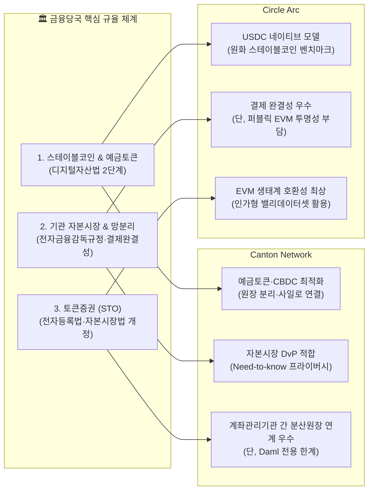
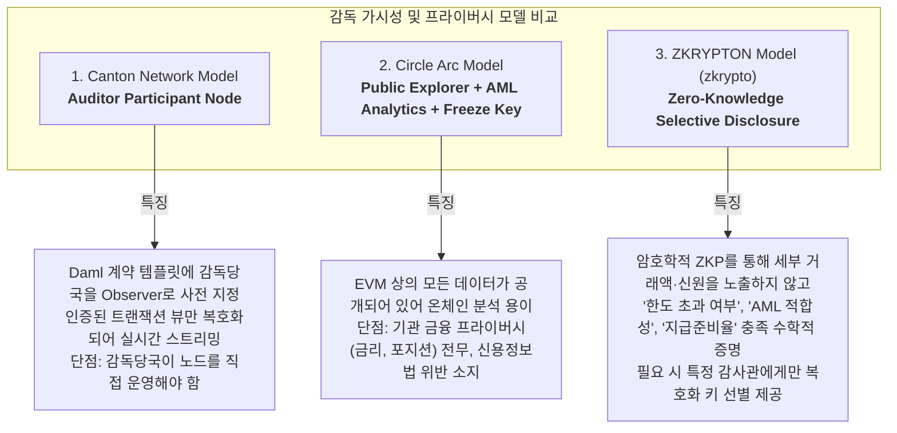

# ⚖️ 금융당국(금감원·금융위·한은) 규제 컴플라이언스 심층 분석
## 스테이블코인 · 기관 자본시장 · 토큰증권(STO) 3대 핵심 의제와 감독 가시성

- **조사일자**: 2026-09-29
- **관련 규제 기관**: 금융위원회(FSC), 금융감독원(FSS), 한국은행(BOK), 금융보안원(FSI)
- **주요 규제 프레임워크**:
  - 가상자산이용자보호법 2단계 (디지털자산기본법)
  - 자본시장법 및 전자등록법 개정안 (토큰증권 제도화)
  - 전자금융감독규정 (금융망분리 완화 및 클라우드/SaaS 가이드라인)
  - 특정금융정보법 (특금법 / AML·CFT·Travel Rule)
  - 채무자회생법 (결제완결성 보장)

---

## 1. 개요 및 정책적 배경 (Regulatory Context 2026)

2026년 현재 대한민국 금융당국은 가상자산이용자보호법 1단계(2024년 7월 시행, 불공정거래 규제 및 자산보호)를 안착시킨 후, **가상자산이용자보호법 2단계(디지털자산기본법)**와 **토큰증권(STO) 법제화**, 그리고 **한국은행 주도의 CBDC 및 예금토큰 실증사업(Project Agora / Mandala)**을 연계하는 포괄적 디지털 금융 체계를 구축하고 있습니다.

특히 금융감독원과 금융위원회는 글로벌 금융기관들이 도입 중인 **Canton Network**와 **Circle Arc**의 아키텍처를 면밀히 분석하며, 국내 금융권이 채택할 수 있는 분산원장 기술 요건과 규제 정합성을 평가하고 있습니다.

---

## 2. 3대 핵심 금융 의제별 규제 적합성 심층 분석

---

### [의제 1] 스테이블코인 및 예금토큰 (Stablecoins & Tokenized Deposits)

#### A. 국내 규제 현안
1. **발행 주체 및 건전성 요건**:
   - 가상자산이용자보호법 2단계의 최대 쟁점은 **원화 스테이블코인의 발행 자격**입니다. 은행권 중심의 컨소시엄 인가(은행법상 예금토큰 모델) vs 일정 자기자본 및 라이선스를 갖춘 전자금융업자(핀테크) 허용 여부.
2. **지급준비자산 100% 안전자산 신탁 의무**:
   - 발행 잔액의 100% 이상을 국채, 은행 예치금 등 고유동성 안전자산으로 예탁결제원 또는 신탁회사에 분리 신탁해야 하며, 이용자에게 우선변제권 부여 필수.
3. **외환거래법 및 자본유출입 통제**:
   - 국경 간 스테이블코인 전송 시 외환전산망 보고의무, 비거주자 원화 취득 규제와의 충돌 해결 필요.

#### B. 체인별 비교 및 금융당국 평가

| 항목 | Canton Network | Circle Arc | 국내 규제 시사점 |
| :--- | :--- | :--- | :--- |
| **토큰 유형** | 예금토큰 (Tokenized Deposit) 및 CBDC 연계 중심 | 법정화폐 담보형 스테이블코인 (USDC 네이티브) | 한은 CBDC/예금토큰 실증에는 Canton이, 민간 스테이블코인 결제에는 Arc 모델이 적합 |
| **준비자산 검증** | 개별 참가자 은행의 로컬 원장 및 중앙은행 상계 정산 | BNY Mellon 신탁 보관 및 매월 독립 회계법인 감사 보고서 | Arc의 준비자산 공시 및 실시간 감시 체계가 국내 금융위 입법 표준안에 직접 반영 가능 |
| **가스비 경제학** | 별도 네이티브 토큰 없음 (도메인별 과금 정책) | **USDC 직접 차감** (법정화폐 페깅) | **Arc의 승리**: 금융기관 회계 상 암호화폐 보유 부담 제로(0), 수수료 원화 산정 용이 |

---

### [의제 2] 기관 자본시장 인프라 및 금융 망분리 (Capital Markets & Network Separation)

#### A. 국내 규제 현안
1. **결제완결성 보장 (채무자회생법 제120조 특례)**:
   - 증권이나 대금의 결제는 거래 상대방의 파산 시에도 취소되거나 번복되어서는 안 됨. 확률적 완결성(Probabilistic Finality)을 갖는 PoW/일반 PoS 체인은 결제완결성 법적 효력 인정 불가.
2. **전자금융감독규정 제15조(망분리) 규제 완화**:
   - 금융당국은 내부 업무망과 외부 인터넷망의 물리적 분리 규제를 단계적으로 완화 중(SaaS/생성형 AI 도입 허용).
   - 그러나 **코어 뱅킹 및 자본시장 거래 데이터가 외부 퍼블릭 블록체인 노드로 유출되는 것은 엄격히 금지**.
3. **24/7 레포(Repo) 및 장외파생 동시결제(DvP)**:
   - 장외 거래 상대방 간의 신용 위험(Counterparty Risk) 제거 및 실시간 담보 차환 필요.

#### B. 체인별 비교 및 금융당국 평가

| 항목 | Canton Network | Circle Arc | 국내 규제 시사점 |
| :--- | :--- | :--- | :--- |
| **결제완결성** | **완전 충족**: Mediator 기반 2PC 승인 즉시 법적 결제 완결 | **완전 충족**: Malachite 합의 기반 서브세컨드 결정론적 완결 | 두 체인 모두 금융결제원 및 예탁원 결제망 연계 요건 충족 |
| **망분리 및 데이터 주권** | **우수**: 참가자 노드가 내부망에 상주하며, Need-to-know 서브트랜잭션만 교환 | **취약**: 퍼블릭 EVM 트랜잭션 전파로 인해 금융 거래 데이터 외부 노출 | Canton은 국내 시중은행 내부망 연동 승인이 용이하나, Arc는 별도 프라이빗 게이트웨이 필요 |
| **원자적 DvP** | 상호운용 도메인 간 브릿지 없는 Atomic Swap 네이티브 지원 | 스마트 컨트랙트 에스크로 기반 지원 (크로스체인은 CCTP 활용) | 대규모 기관 간 채권/레포 결제에는 Canton의 크로스-도메인 원자성이 압도적 유리 |

---

### [의제 3] 토큰증권 (STO) 제도화 (Security Token Offerings)

#### A. 국내 규제 현안 (전자등록법·자본시장법 개정안)
1. **분산원장 기재 요건 (금융위 가이드라인)**:
   - 복수 참여자(노드) 간의 분산 검증 및 실시간 동기화.
   - 51% 공격 등 분산원장 조작을 방지할 수 있는 합의 알고리즘.
   - 하드포크(체인 분기)가 발생하지 않는 결정론적 완결성.
2. **계좌관리기관 요건 및 원장 관리 의무**:
   - 증권사나 은행이 계좌관리기관으로서 권리자 명부와 분산원장 간의 1:1 일치(오차 정정권한)를 유지해야 함.
   - 투자자의 실수나 키 분실 시 **법적 권리 구제(강제 이전 및 재발행 권한)**가 스마트 컨트랙트 레벨에서 강제되어야 함.
3. **개인정보보호법 및 잊힐 권리**:
   - 주민등록번호, 실명, 계좌번호 등 개인식별정보(PII)의 온체인 불변 기록 절대 금지.

#### B. 체인별 비교 및 금융당국 평가

| 항목 | Canton Network | Circle Arc | 국내 규제 시사점 |
| :--- | :--- | :--- | :--- |
| **분산원장 요건 충족** | Daml 권한 모델로 발행사·계좌관리기관 권한 분립 명확 | 기관 밸리데이터 컨소시엄 기반으로 분산 요건 충족 | 두 모델 모두 금융위가 요구하는 '허가형 분산원장' 요건 충족 |
| **관리자 강제 이전권** | Daml의 Signatory/Controller 권한으로 법적 집행 100% 구현 | ERC-3643 / ERC-1400 등 규제 준수 토큰 표준 배포 가능 | 스마트 컨트랙트 레벨의 권리 구제는 두 체인 모두 구현 가능 |
| **개인정보 보호** | **원천 해결**: 서브트랜잭션 뷰 암호화로 당사자 외 PII 노출 불가 | **추가 조치 필요**: 온체인 해시화 및 오프체인 분리 보관 필수 | Canton이 국내 개인정보보호법 및 신용정보법 기준에 직관적 부합 |

---

## 3. 감독 가시성 vs 금융 프라이버시 (The Privacy-Auditability Balance)

금융당국(금감원)의 최대 딜레마는 **"어떻게 하면 기관의 영업 기밀과 금융 프라이버시를 지키면서도, 감독당국의 실시간 이상거래 감시(SupTech) 권한을 보장할 것인가?"**입니다.

### 금융감독원을 위한 최종 권고사항
1. **스테이블코인 결제망**: Circle Arc의 **"법정화폐 네이티브 가스 + 기관 검증인셋"** 아키텍처를 원화(KRW) 결제망 설계에 표준 벤치마킹 모델로 수용.
2. **자본시장 및 STO 인프라**: Canton의 **"서브트랜잭션 프라이버시 및 크로스-도메인 원자적 DvP"** 메커니즘을 제도권 장외결제 및 토큰증권 분산원장 기술 표준 요건으로 참조.
3. **차세대 인프라 혁신**: ZKRYPTON과 같은 **"EVM 호환성 + 고성능 zkBFT + 영지식 증명(ZKP) 기반 선택적 규제 증명"** 기술을 채택하여, 외산 인프라에의 종속을 탈피하고 국내 망분리 및 데이터 주권을 완벽히 수호할 것을 권고.

---

## 4. 금융당국 규제 관점 3사 종합 비교 매트릭스

| 규제 분석 항목 | 🏛️ Canton Network | 🌐 Circle Arc | 🛡️ ZKRYPTON (zkrypto) |
| :--- | :--- | :--- | :--- |
| **전자금융감독규정 (망분리)** | **적합**: 내부망 노드 격리 및 암호화 봉투 라우팅 | **부적합**: 퍼블릭 노드 간 트랜잭션 전파로 망분리 위반 | **최적화**: 내부망 상주 노드 + 보안 게이트웨이 표준화 |
| **개인정보보호법 (잊힐 권리)** | **충족**: 서브트랜잭션 뷰 암호화로 원천 보호 | **주의**: 온체인 상태 공개로 오프체인 해시화 필수 | **완전 충족**: ZKP로 개인식별정보(PII) 온체인 기록 제로화 |
| **자본시장법 (결제완결성)** | **인정**: Mediator 2PC 승인 즉시 법적 효력 | **인정**: Malachite 서브세컨드 확정성 | **완전 인정**: zkBFT 즉시 확정 (채무자회생법 120조 완벽 부합) |
| **가상자산이용자보호법 2단계** | 예금토큰 및 CBDC 실증에 최적 | 법정화폐 스테이블코인 100% 준비자산 벤치마크 | **원화 스테이블코인 및 은행권 예금토큰 동시 수용 가능** |
| **감독 가시성 (SupTech)** | 감독당국 전용 Auditor Node 운영 필요 | 중앙화된 블랙리스트/동결권 + 온체인 포렌식 | **암호학적 규제 준수 영지식 증명 (노드 구축 부담 제로)** |
