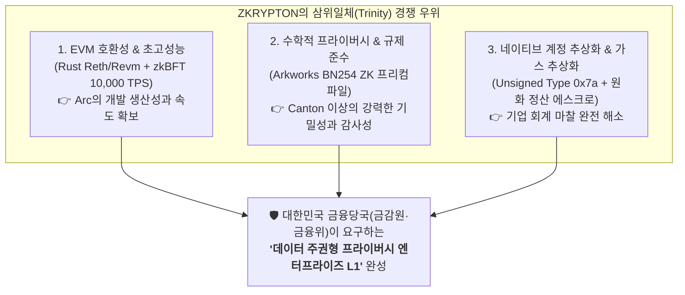
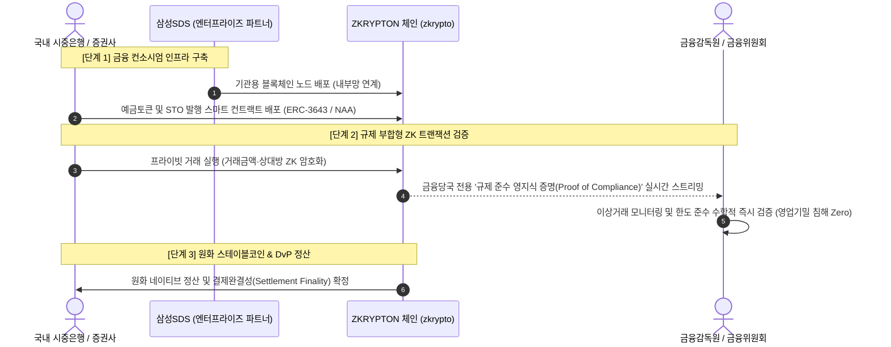

# 🧭 종합 비교 매트릭스 및 ZKRYPTON 전략 보고서
## Canton Network vs Circle Arc vs ZKRYPTON 4대 축 비교 및 국내 제도권 선점 전략

- **조사일자**: 2026-09-29
- **비교 대상**:
  1. **Canton Network** (Digital Asset 주도 기관용 프라이버시 상호운용 네트워크)
  2. **Circle Arc** (Circle 주도 스테이블코인 네이티브 L1 결제 체인)
  3. **ZKRYPTON** (지크립토 개발 차세대 엔터프라이즈 ZK-EVM 금융 블록체인)

---

## 1. 4대 핵심 축 종합 비교 매트릭스 (Comparative Matrix)

| 구분 | 🏛️ Canton Network | 🌐 Circle Arc | 🛡️ ZKRYPTON (zkrypto) |
| :--- | :--- | :--- | :--- |
| **핵심 포지셔닝** | 글로벌 전통 금융기관 간 프라이버시 상호운용 네트워크 | 스테이블코인 네이티브 고속 결제 및 경제 OS | **국내 제도권 최적화 프라이버시 엔터프라이즈 ZK-EVM** |
| **주요 주도사** | Digital Asset, DTCC, Euroclear, Goldman Sachs | Circle, BlackRock, Visa, Mastercard, DTCC | **지크립토 (zkrypto), 삼성SDS 등 국내 컨소시엄** |

---

### [축 1] 코어 아키텍처 및 합의 메커니즘 (Architecture & Consensus)

| 기술 요소 | Canton Network | Circle Arc | ZKRYPTON |
| :--- | :--- | :--- | :--- |
| **코어 엔진 및 VM** | Daml 런타임 (비-EVM, 함수형 스마트 계약) | **완전 EVM 호환** (Chain ID: 5042) | **Rust Reth / Revm 초고성능 EVM 엔진** |
| **합의 알고리즘** | Canton Protocol (시퀀서 총순서화 + 미디에이터 2PC) | Malachite BFT 합의 | **zkBFT** (Stable Leader N-블록 재임 + BLS 집계 서명) |
| **완결성 (Finality)** | 결정론적 완결성 (Mediator 서명 확정 시) | 결정론적 완결성 (Sub-second 확정) | **결정론적 완결성** (Sub-second 즉시 확정, Fork-free) |
| **처리 성능 (TPS)** | 도메인별 수백 TPS (크로스도메인 시 레이턴시 발생) | 수천 TPS (기관 결제망 수준) | **1,000 ~ 10,000 TPS** (실측 벤치마크 검증) |
| **가스비 경제학** | 도메인별 정책 과금 (자체 유틸리티 토큰 배제) | **USDC 네이티브 가스** (달러 확정 비용) | **Native Account Abstraction (NAA 0x7a)** 기반 가스 대납 및 원화 정산 에스크로 |
| **계정 모델** | Party / Contract Key 기반 UTXO 변형 모델 | 표준 이더리움 계정 모델 (Externally Owned Account) | **NAA 네이티브 계정 추상화** (서명 분리, 세션키, 2단계 병렬검증/순차실행) |

---

### [축 2] 프라이버시 및 암호학 기술 (Privacy & Cryptography)

| 기술 요소 | Canton Network | Circle Arc | ZKRYPTON |
| :--- | :--- | :--- | :--- |
| **프라이버시 모델** | **Sub-transaction Privacy** (Need-to-know 뷰 투영) | 없음 (Public EVM Ledger, 모든 상태 공개) | **영지식 증명 (Zero-Knowledge Proofs, ZKP)** |
| **원장 데이터 가시성** | 거래 이해관계자 및 지정된 관찰자(Observer)만 복호화 | 모든 주소, 잔액, 스마트 컨트랙트 호출 전체 공개 | **상태 기밀성 보장 + 수학적 영지식 증명 온체인 검증** |
| **암호학 가속 인프라** | 대칭키 암호화 및 서명 검증 | 표준 secp256k1 및 기본 EVM 프리컴파일 | **Arkworks BN254 프리컴파일 패치** + 페어링 캐시 (`PAIR_CACHE`) |
| **키 관리 & 보안 모델** | 참가자 자체 KMS/HSM 연동 | 기관 밸리데이터 자체 인프라 | **MPC 셰어볼트 + HSM/sHSM + AMD SEV + eBPF/SELinux** 다층 방어 |

---

### [축 3] 금융당국 규제 및 컴플라이언스 부합성 (Regulatory Compliance)

| 규제 항목 | Canton Network | Circle Arc | ZKRYPTON |
| :--- | :--- | :--- | :--- |
| **금융 망분리 적합성** | **우수**: 참가자 노드 내부망 격리 및 암호화 봉투 통신 | **취약**: 퍼블릭 노드 데이터 브로드캐스트로 망분리 저촉 | **최적화**: 금융사 내부망 상주 노드 + 외부 연계 게이트웨이 표준화 |
| **금융실명제/신용정보법** | 계약 뷰 비공개로 개인정보 온체인 노출 차단 | 온체인 거래 내역 전면 공개로 법령 저촉 위험 | **ZKP 기반 선택적 공개(Selective Disclosure)**로 법적 충족 |
| **감독당국 감사 가시성** | **Auditor Participant Node** (Daml Observer 지정) | 중앙화된 Circle 블랙리스트/동결권 + 온체인 포렌식 | **암호학적 감사 증명**: 거래 기밀 유지 상태에서 건전성·한도 실시간 증명 |
| **국내 주권 통제성** | 슈퍼 밸리데이터(SV)의 해외 금융사 독점으로 국내 통제 한계 | 미국 재무부(OFAC) 및 Circle에 단일 종속 위험 | **완전한 국내 주권 확보**: 국내 시중은행/금융사 컨소시엄 거버넌스 |

---

### [축 4] 상호운용성 및 확장 전략 (Interoperability & Integration)

| 항목 | Canton Network | Circle Arc | ZKRYPTON |
| :--- | :--- | :--- | :--- |
| **크로스체인 연결 방식** | Global Synchronizer 기반 브릿지리스 원자적 동시결제 | CCTP (Cross-Chain Transfer Protocol) 소각·발행 | **체인 어댑터(Chain Adapter)** 모듈러 인터페이스 |
| **외부 생태계 호환성** | Daml 전용 생태계로 기존 Web3 디파이와 격리 | 이더리움, 아비트럼, 솔라나 등 퍼블릭 유동성 흡수 | **EVM 100% 호환**으로 기존 Solidity 자산 및 Web3 툴링 즉시 활용 |

---

## 2. ZKRYPTON 핵심 기술 차별화 분석 (Technical Edge)

1. **Circle Arc 대비 ZKRYPTON의 기술 우위**:
   - **완벽한 금융 프라이버시**: Arc는 모든 트랜잭션이 투명하게 공개되어 국내 신용정보법 및 금융실명법을 위반할 소지가 크지만, ZKRYPTON은 **Arkworks 기반의 고성능 BN254 ZK 프리컴파일**을 통해 온체인 잔액과 거래 상대방을 암호학적으로 은닉합니다.
   - **네이티브 계정 추상화 (NAA 0x7a)**: Arc는 표준 EOA 중심이지만, ZKRYPTON은 네이티브 레벨에서 32바이트 인증키, 세션키, 병렬 검증/순차 실행, 수수료 사전 차감(Escrow)을 지원하여 금융기관 전용 서명 체계를 완벽히 수용합니다.
2. **Canton Network 대비 ZKRYPTON의 기술 우위**:
   - **개발 생산성 및 생태계 확장성**: Canton은 난해한 함수형 언어인 Daml을 필수로 요구하여 개발자 확보와 기존 스마트 컨트랙트 이식이 불가능에 가깝습니다. 반면 ZKRYPTON은 **Solidity 및 이더리움 표준(ERC-3643, ERC-20 등)을 100% 그대로 활용**할 수 있습니다.
   - **아키텍처 단순성 및 레이턴시**: Canton의 크로스-도메인 트랜잭션은 복수의 시퀀서와 미디에이터 간 복잡한 다자간 라운드트립을 거쳐 레이턴시가 급증하지만, ZKRYPTON은 **단일 zkBFT 엔진에서 서브세컨드 확정성**을 달성합니다.

---

## 3. ZKRYPTON 국내 제도권 시장 선점 로드맵 (Actionable Strategy)

### 전략 1: 삼성SDS 협력 기반 은행권 "토큰화 예금(Tokenized Deposit)" 컨소시엄 주도
- **접근 방식**: 한국은행 CBDC 및 아고라(Agora) 프로젝트의 국내 민간 대응망으로서, 삼성SDS의 엔터프라이즈 클라우드 인프라와 결합하여 ZKRYPTON 기반의 **은행 간 예금토큰 결제망 PoC**를 선제 추진.
- **차별점**: Canton의 비-EVM 폐쇄성과 Arc의 해외 종속성을 지적하며, **"국내 금융망분리 가이드라인을 완벽히 충족하는 국산 ZK-EVM 코어"**임을 부각.

### 전략 2: 토큰증권(STO) 계좌관리기관 표준 분산원장 포지셔닝
- **접근 방식**: 전자등록법 개정에 대비하여, 증권사 및 조각투자 플랫폼을 대상으로 **계좌관리기관 요건(권리자 명부 1:1 일치, 관리자 강제 이전권, 개인정보 온체인 미기재)**을 100% 충족하는 ZKRYPTON STO 레퍼런스 아키텍처 제공.
- **차별점**: 투자자 잔고를 ZKP로 보호하면서도, 금융감독원 감사 노드에만 법적 감사 증명을 제공하는 **선택적 공개(Selective Disclosure) 솔루션** 공급.

### 전략 3: 원화(KRW) 스테이블코인 네이티브 결제망 레퍼런스 선점
- **접근 방식**: Circle Arc의 'USDC 네이티브 가스 모델'의 장점만을 차용하여, ZKRYPTON의 NAA(Type 0x7a)를 활용한 **"원화 연동 결제 및 수수료 대납(Paymaster) 인프라"**를 표준 구현.
- **차별점**: 국내 기업들이 가상자산을 보유하지 않고도 원화(KRW) 법인 계좌를 통해 트랜잭션 비용을 일괄 정산받을 수 있는 엔터프라이즈 친화적 환경 제공.

---

## 4. 결론 및 종합 제언

Canton Network와 Circle Arc는 글로벌 기관 금융의 블록체인 도입이 이미 거스를 수 없는 대세임을 증명하고 있습니다.
- **Canton Network**는 **"프라이버시와 원자적 결제"**의 중요성을,
- **Circle Arc**는 **"법정화폐 연동 예측 가능 수수료와 기관 컨소시엄"**의 위력을 입증했습니다.

**ZKRYPTON**은 이 두 거인의 장점(Canton의 강력한 프라이버시 + Arc의 친숙한 EVM 호환성 및 수수료 예측 가능성)을 모두 흡수하는 동시에, **수학적 영지식 증명(Arkworks BN254 ZKP)**과 **Rust Revm 초고성능 zkBFT 엔진**을 통해 글로벌 체인들이 풀지 못한 한계를 극복했습니다.

국내 금융감독원과 금융위원회가 본격적인 제도화 드라이브를 걸고 있는 현시점, ZKRYPTON은 **"국내 법제(망분리·금융실명제·STO·스테이블코인)에 가장 완벽하게 부합하는 국가대표 금융 블록체인 인프라"**로서 시장을 선점할 수 있는 결정적 기회를 맞이하고 있습니다.
