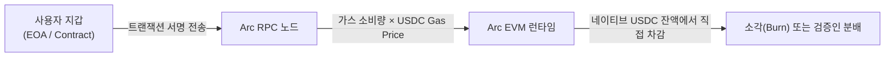

# 💻 Circle Arc 개발자 심층 가이드
## USDC 네이티브 가스 메커니즘, EVM 아키텍처 및 CCTP 연동

- **문서 목적**: Web3 엔지니어 및 핀테크 개발자를 위한 Circle Arc L1 체인 스펙, USDC 수수료 처리 방식, 스마트 계약 배포 및 CCTP 연동 가이드 제공
- **대상 독자**: Solidity 스마트 컨트랙트 엔지니어, 결제 시스템 개발자, 금융 앱 프론트/백엔드 아키텍트

---

## 1. 네트워크 기술 파라미터 및 연결 명세

Circle Arc는 완전한 EVM(Ethereum Virtual Machine) 호환성을 제공하므로, 기존 이더리움 도구(Foundry, Hardhat, MetaMask, Viem, Ethers.js)를 그대로 활용할 수 있습니다.

| 파라미터 | 메인넷 (Mainnet) | 테스트넷 (Testnet) |
| :--- | :--- | :--- |
| **네트워크 이름** | Circle Arc Mainnet | Circle Arc Testnet |
| **체인 식별자 (Chain ID)** | `5042` | `50420` |
| **RPC 엔드포인트** | `https://rpc.mainnet.arc.io` | `https://rpc.testnet.arc.io` |
| **기본 가스 통화 (Gas Currency)** | **USDC** (소수점 6자리) | **USDC** (Testnet Faucet) |
| **블록 익스플로러** | `https://explorer.arc.io` | `https://testnet.explorer.arc.io` |
| **합의 완결 시간** | ~400ms (결정론적 Sub-second) | ~400ms |

---

## 2. USDC 네이티브 가스 모델 및 동작 원리

기존 EVM 체인은 `wei` 단위(18자리)로 가스를 계산하지만, Arc는 프로토콜 기저에서 **마이크로센트(10^-6 USDC)** 단위로 가스 요금을 직접 측정합니다.



### A. EIP-3009 (`transferWithAuthorization`) 기반 가스리스 트랜잭션
Arc에서는 사용자가 지갑에 가스비가 전혀 없어도, 오프체인 서명(EIP-712)만으로 백엔드 서버(Relayer)가 수수료를 대납(Paymaster)하도록 기본 지원합니다.

```typescript
// scripts/gaslessTransfer.ts
import { ethers } from "ethers";

// EIP-712 서명 타입 정의
const domain = {
  name: "USD Coin",
  version: "2",
  chainId: 5042,
  verifyingContract: "0x0000000000000000000000000000000000000000", // 네이티브 USDC 주소
};

const types = {
  TransferWithAuthorization: [
    { name: "from", type: "address" },
    { name: "to", type: "address" },
    { name: "value", type: "uint256" },
    { name: "validAfter", type: "uint256" },
    { name: "validBefore", type: "uint256" },
    { name: "nonce", type: "bytes32" },
  ],
};

async function signGaslessTransfer(signer: ethers.Signer, to: string, amountUSDC: bigint) {
  const from = await signer.getAddress();
  const validAfter = 0;
  const validBefore = Math.floor(Date.now() / 1000) + 3600; // 1시간 유효
  const nonce = ethers.hexlify(ethers.randomBytes(32));

  const value = {
    from,
    to,
    value: amountUSDC,
    validAfter,
    validBefore,
    nonce,
  };

  // EIP-712 오프체인 서명 생성
  const signature = await signer.signTypedData(domain, types, value);
  const { v, r, s } = ethers.Signature.from(signature);

  return { from, to, amountUSDC, validAfter, validBefore, nonce, v, r, s };
}
```

---

## 3. 스마트 컨트랙트 배포 설정 (Foundry & Viem)

### A. `foundry.toml` 설정 예시
```toml
[profile.default]
src = "src"
out = "out"
libs = ["lib"]

[rpc_endpoints]
arc_mainnet = "https://rpc.mainnet.arc.io"
arc_testnet = "https://rpc.testnet.arc.io"

[etherscan]
arc_mainnet = { key = "NO_KEY_NEEDED", url = "https://explorer.arc.io/api" }
```

### B. 스마트 컨트랙트 배포 명령어
```bash
# Circle Arc 메인넷에 배포 (USDC 가스로 지불)
forge create src/InstitutionalVault.sol:InstitutionalVault \
  --rpc-url arc_mainnet \
  --private-key $DEPLOYER_PRIVATE_KEY \
  --broadcast
```

---

## 4. CCTP (Cross-Chain Transfer Protocol) v2 연동

Circle Arc의 핵심 강점은 이더리움, 아비트럼, 솔라나 등의 외부 체인과 **브릿지 해킹 위험 없는 네이티브 1:1 소각·발행**을 수행할 수 있다는 점입니다.

```solidity
// SPDX-License-Identifier: MIT
pragma solidity ^0.8.20;

interface ITokenMessenger {
    function depositForBurn(
        uint256 amount,
        uint32 destinationDomain,
        bytes32 mintRecipient,
        address burnToken
    ) external returns (uint64 _nonce);
}

contract ArcCrossChainPayment {
    ITokenMessenger public immutable tokenMessenger;
    address public immutable usdc;

    // 도메인 ID 매핑 (0: Ethereum, 3: Arbitrum, 5042: Arc)
    constructor(address _tokenMessenger, address _usdc) {
        tokenMessenger = ITokenMessenger(_tokenMessenger);
        usdc = _usdc;
    }

    function bridgeToArbitrum(uint256 amount, address recipient) external {
        // 1. 송금인의 USDC를 컨트랙트로 입금
        // 2. CCTP TokenMessenger를 통해 Arc에서 소각 후 Arbitrum에서 민팅 트리거
        bytes32 mintRecipient = bytes32(uint256(uint160(recipient)));
        uint32 arbitrumDomain = 3;

        tokenMessenger.depositForBurn(amount, arbitrumDomain, mintRecipient, usdc);
    }
}
```

---

## 5. Circle Arc vs ZKRYPTON 개발자 관점 종합 비교

| 개발 분석 항목 | 🌐 Circle Arc | 🛡️ ZKRYPTON (zkrypto) | 개발자 관점 평가 및 시사점 |
| :--- | :--- | :--- | :--- |
| **코어 실행 엔진** | Malachite BFT 기반 EVM 구현체 | **Rust Reth / Revm 기반 초고성능 EVM** | ZKRYPTON이 실측 10,000 TPS로 블록 생성 및 트랜잭션 실행 속도 우위 |
| **가스비 정산 통화** | **USDC (미국 달러 연동)** 단일 통화 | **NAA (0x7a) 원화 정산 에스크로 & 멀티 가스** | Arc는 글로벌 결제에, ZKRYPTON은 국내 금융기관 원화(KRW) 결제에 최적화 |
| **계정 추상화 구현 방식** | EIP-3009 / EIP-4337 (별도 번들러 의존) | **네이티브 계정 추상화 (Unsigned Type 0x7a)** | ZKRYPTON은 별도 번들러 없이 코어 노드에서 2단계 병렬검증/순차실행 지원 |
| **영지식 증명(ZKP) 가속** | 표준 이더리움 프리컴파일 (bn256 느림) | **Arkworks BN254 고속 프리컴파일 + 페어링 캐시** | ZKRYPTON이 ZK 증명 검증 비용(Gas)을 80% 이상 절감하여 프라이버시 구현 용이 |
| **개발 도구 및 라이브러리** | Foundry, Hardhat, Viem 100% 호환 | **Foundry, Hardhat, Viem 100% 호환** | 두 체인 모두 기존 Web3 생태계 도구를 그대로 사용하여 러닝커브 제로 |
| **온체인 프라이버시 API** | 없음 (모든 잔액 및 스마트 계약 로직 공개) | **선택적 공개(Selective Disclosure) ZK API 제공** | 금융 컴플라이언스(비밀보장) 구현 시 ZKRYPTON이 압도적으로 유리 |
