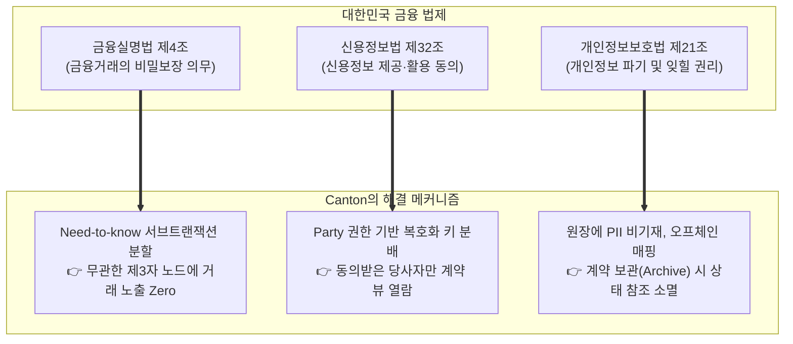

# ⚖️ Canton Network 컴플라이언스 심층 가이드
## 계약 법률 강제, 금융 프라이버시 법제 및 실시간 감독 가시성

- **문서 목적**: 금융당국(금감원·금융위), 법무법인 및 금융기관 컴플라이언스(준법감시) 부서를 위한 Canton Network의 법적 유효성, 개인정보 보호 및 규제 감독 기술 명세 제공
- **대상 독자**: 최고준법감시책임자(CCO), 금융 규제 변호사, 금융보안원 심사관, SupTech 연구원

---

## 1. 스마트 컨트랙트의 법적 구속력 (Contract Law as Code)

Canton Network는 스마트 컨트랙트를 단순한 상태 기계(State Machine)가 아닌, **상법 및 민법상의 유효한 '법적 계약'**으로 취급하도록 설계되었습니다.

### A. Daml Signatory 모델과 전자서명법 정합성
- **서명 강제성**: Daml 계약의 모든 `signatory`는 해당 계약의 조건에 동의한 법적 서명자로 간주됩니다.
- 전자서명법 및 전자문서법에 따라, 인가된 인증서(PKI 또는 금융인증서)와 연계된 개인키로 서명된 Daml 트랜잭션은 **법적 유효 계약으로서의 증거력**을 갖습니다.

### B. 결제 완결성 (Settlement Finality)과 채무자회생법
- 채무자회생법 제120조에 따르면, 금융결제원 및 예탁결제원 결제망을 통한 결제는 일방의 파산 시에도 취소되지 않는 '결제 완결성'이 보장됩니다.
- Canton Protocol의 **미디에이터(Mediator) 2PC 최종 판정**은 분기(Fork)가 불가능한 결정론적 이벤트이므로, **법적 결제 완결 시점**을 명확히 특정할 수 있습니다.

---

## 2. 금융정보 보호 및 개인정보보호법 적합성

대한민국 금융 규제의 핵심 난제는 **"원장의 불변성"**과 **"금융 거래 비밀보장 및 잊힐 권리"** 간의 충돌입니다.



- **금융실명법 준수**: 거래 당사자 외의 타 은행이나 노드 운영자는 거래 금액, 금리, 자산 종류를 일절 볼 수 없으므로 비밀보장 의무를 완벽히 준수합니다.
- **개인정보 파기 의무 대응**: 실명 및 계좌번호는 금융사 내부 CRM에만 보관하고, 온체인에는 무작위 생성된 `Party ID`만 기록하여, 계약 보관(Archive) 시 데이터 연결성을 영구 차단합니다.

---

## 3. 금융감독원 전용 "Auditor Participant Node" 아키텍처

Canton Network는 금융감독원이나 한국은행이 **실시간 규제 감독(SupTech)**을 수행할 수 있도록 전용 감사관 노드 체계를 지원합니다.


### A. 규제 당국 Observer 자동 지정 패턴
```haskell
-- 금융위/금감원 인가 템플릿 표준
template RegulatedSecurityToken
  with
    regulator : Party      -- 금융감독원
    issuer : Party         -- 발행사
    owner : Party          -- 소유자
    amount : Decimal
  where
    signatory issuer
    observer owner, regulator   -- 금감원이 모든 상태 변경을 실시간 관찰
```
- 금융감독원은 별도의 서명 권한 없이 **읽기 전용 관찰자(Observer)**로 참여하여, 금융기관의 거래가 발생하는 즉시 실시간 원장 데이터를 스트리밍 받아 자본비율 산출 및 이상거래 탐지(FDS)를 수행할 수 있습니다.

---

## 4. 전자금융감독규정 (망분리) 규제 준수 아키텍처

금융기관 내부 업무망(코어 뱅킹)과 외부 분산원장 동기화 망 간의 연계는 엄격한 보안 요건을 요구합니다.

```text
[ 내부 업무망 (Internal Network) ]
    ├── 코어 뱅킹 / 계정계 원장
    └── Canton Participant Node (로컬 PostgreSQL 상태 원장)
              │
    [ 보안 게이트웨이 (mTLS / 망간자료전송체계) ]
              │
[ 외부 금융 동기화망 (Canton Domain) ]
    └── Canton Sequencer & Mediator (암호화 봉투만 중계)
```

- **핵심 장점**: 민감 데이터가 저장된 원장(Participant Node)이 금융사 내부망에 완벽히 격리되어 있으므로, 금융보안원의 **망분리 보안성 심의를 가장 수월하게 통과**할 수 있습니다.

---

## 5. Canton Network vs ZKRYPTON 컴플라이언스 관점 종합 비교

| 규제 분석 항목 | 🏛️ Canton Network | 🛡️ ZKRYPTON (zkrypto) | 컴플라이언스 관점 평가 및 시사점 |
| :--- | :--- | :--- | :--- |
| **금융 망분리 적합성** | **우수**: 참가자 노드 내부망 격리 및 암호화 봉투 중계 | **최적화**: 내부망 전용 노드 + 보안 게이트웨이 표준 아키텍처 | 두 체인 모두 금융보안원 망분리 기준을 100% 충족 가능 |
| **감독 가시성 (SupTech)** | **Auditor Participant Node** 설치 (Daml Observer) | **ZKP 기반 선택적 규제 증명 (Selective Disclosure)** | Canton은 감독당국이 노드를 유지해야 하지만, ZKRYPTON은 가벼운 ZK 검증기만으로 감사 가능 |
| **금융실명제/비밀보장** | **Need-to-know 서브트랜잭션**으로 미인가자 차단 | **수학적 영지식 증명(ZKP)**으로 온체인 데이터 암호학적 은닉 | ZKRYPTON이 정보 노출 위험(Leakage)에 대해 한층 강력한 수학적 기밀성 보장 |
| **결제완결성 법적 보장** | 미디에이터 2PC 서명 확정 (채무자회생법 120조 부합) | **zkBFT 즉시 확정 (결정론적 Sub-second Finality)** | 두 체인 모두 포크가 발생하지 않아 법적 결제완결성 공인 가능 |
| **데이터 주권 및 국외 이전** | 글로벌 슈퍼밸리데이터(SV) 경유로 인한 데이터 국외 이전 논란 | **국내 시중은행 및 삼성SDS 단독 컨소시엄 구축** | ZKRYPTON이 국가 핵심 금융 데이터의 국내 주권 수호에 완벽 부합 |
