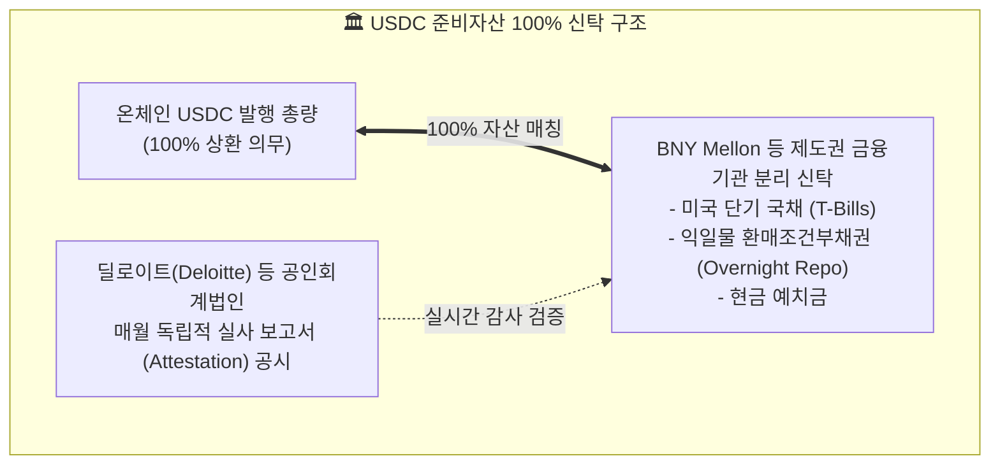
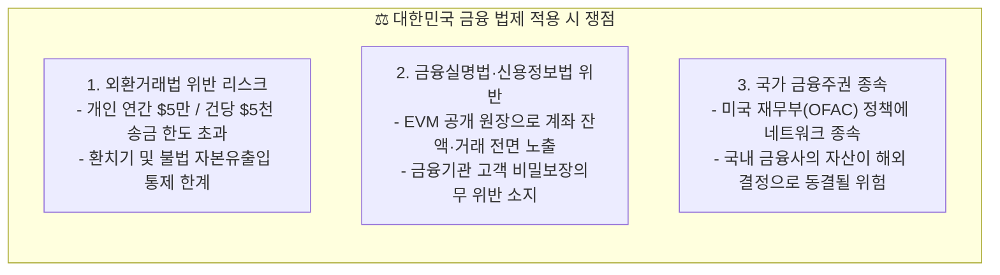

# ⚖️ Circle Arc 컴플라이언스 심층 가이드
## 준비자산 법제, 스마트 컨트랙트 동결권, 트래블룰 및 국내 금융 법제 영향

- **문서 목적**: 금융당국(금감원·금융위), 법무법인 및 가상자산 사업자(VASP)를 위한 Circle Arc의 준비자산 건전성 규제, 사법 집행력(블랙리스트/동결), 트래블룰 및 한국 법제 적용 시 쟁점 분석 제공
- **대상 독자**: 금융위 디지털자산TF, 금감원 가상자산감독국, 시중은행 디지털자산 담당자, 금융 로펌 변호사

---

## 1. 법정 준비자산 100% 신탁 및 도산격리 (Bankruptcy Remoteness)

Circle Arc의 네이티브 가스 토큰인 USDC는 글로벌 스테이블코인 규제 법안(미국 NYDFS 규정, FIT21, EU MiCA)을 가장 엄격하게 준수하는 자산입니다.



### A. 도산격리(Bankruptcy Remoteness)와 이용자 우선변제권
- **구조**: 준비자산은 Circle사의 고유 자산과 엄격히 분리되어 독립된 신탁 계정에 보관됩니다.
- **법적 효과**: Circle사가 파산하더라도 해당 준비자산은 파산재단에 편입되지 않으며, USDC 보유자가 **제1순위 변제권(Super-priority Claim)**을 행사하여 1:1 달러로 환급받을 수 있습니다.
- **국내 시사점**: 대한민국 **가상자산이용자보호법 제6조(예치금의 보호)**에서 요구하는 "이용자 예치금의 은행 분리 신탁 및 양도/담보 제공 금지" 요건을 완벽히 선제 충족하는 모델입니다.

---

## 2. 스마트 컨트랙트 레벨의 사법 집행 기능 (Law Enforcement Controls)

Circle Arc는 퍼블릭 체인이면서도 각국 사법기관(경찰, 검찰, FBI, 인터폴)의 법적 영장 집행을 수용하기 위해 스마트 컨트랙트 기저에 강력한 **자산 압류 및 동결(Asset Freeze) 인터페이스**를 내장하고 있습니다.

```solidity
// USDC 스마트 컨트랙트 내장 법 집행 인터페이스
interface IBlacklistable {
    event Blacklisted(address indexed _account);
    event UnBlacklisted(address indexed _account);
    event BlacklisterChanged(address indexed newBlacklister);

    function isBlacklisted(address _account) external view returns (bool);
    function blacklist(address _account) external; // 사법 영장에 따른 자산 동결
    function unBlacklist(address _account) external;
    function wipeBlacklistedAccount(address _account) external; // 동결 자산 국고 환수
}
```

### 사법 집행 프로세스
1. **영장 수령**: 사법당국 또는 법원이 특정 지갑 주소에 대한 압류/동결 명령을 Circle 컴플라이언스 팀에 전달.
2. **트랜잭션 실행**: Circle의 인가된 `Blacklister` 다중서명 지갑이 온체인 `blacklist(address)` 트랜잭션을 실행.
3. **즉각적 전송 차단**: 동결된 주소는 해당 시점부터 USDC 송금, 수취, 가스비 지불이 100% 차단됨.
4. **국고 몰수 지원**: 법원의 최종 몰수 판결 시 `wipeBlacklistedAccount()`를 호출하여 자산을 회수하고 피해자 구제 또는 국고 귀속 가능.

---

## 3. AML / CFT 및 트래블룰 (Travel Rule) 규정 준수

- **기업 신원 확인 (KYB / KYC)**:
  - Arc 노드에서 대규모 법정화폐 환전(On/Off-ramp)을 수행하려면 **Circle Mint** 기관 인증을 필수로 통과해야 하며, 전신환 송금인/수취인 실사가 실시간 진행됩니다.
- **트래블룰 연동**:
  - 한국 특금법 제5조의3에 따른 가상자산 이전 시 송수신자 정보(이름, 국적, 가상자산 주소 등) 보고의무를 충족하기 위해, 글로벌 표준인 **IVMS 101** 및 **TRISA / Verite** 프로토콜과 연동됩니다.

---

## 4. 대한민국 법제 적용 시 핵심 쟁점 및 한계



1. **외환 규제 충돌**: Arc를 통한 국경 간 무역 대금 결제 시, 한국은행 외국환전산망 실시간 보고 및 외국환은행 경유 의무와의 정합성 해결이 필수적입니다.
2. **원장 공개성과 개인정보 침해**: 모든 지갑의 거래 데이터가 블록체인 익스플로러에 공개되므로, 국내 시중은행이 고객 계좌를 Arc 위에 직접 올릴 경우 **금융실명법상 금융거래 비밀보장 의무 위반**이 성립할 수 있습니다.

---

## 5. Circle Arc vs ZKRYPTON 컴플라이언스 관점 종합 비교

| 규제 분석 항목 | 🌐 Circle Arc | 🛡️ ZKRYPTON (zkrypto) | 컴플라이언스 관점 평가 및 시사점 |
| :--- | :--- | :--- | :--- |
| **준비자산 규제 모델** | 미국 달러 국채 100% 신탁 (미국 규제 최적화) | **원화(KRW) 예치금 및 국채 신탁 지원** | ZKRYPTON은 국내 가상자산이용자보호법 2단계에 최적화된 원화 결제망 제공 |
| **사법 집행 (자산 동결)** | Circle 중앙 단독 관리자의 `blacklist()` 강제 | **인가된 국내 금융사 컨소시엄 다중서명 집행** | Arc는 단일 기업 종속 리스크가 있으나, ZKRYPTON은 법원 및 금융당국 인가 모델 |
| **금융 비밀보장 (프라이버시)** | **취약**: 모든 지갑 주소, 잔액, 이체 내역 전면 공개 | **완전 충족: Arkworks BN254 영지식 증명(ZKP)** | ZKRYPTON만이 국내 신용정보법 및 금융실명법의 기밀성 요건을 완벽히 만족 |
| **감독 가시성 (SupTech)** | 사후 온체인 데이터 포렌식 분석 (체이널리시스 등) | **수학적 영지식 규제 증명 (Selective Disclosure)** | ZKRYPTON은 영업기밀 침해 없이 금융당국에 건전성 증명 데이터만 실시간 제출 |
| **국가 금융주권 통제성** | 미국 재무부(OFAC) 및 미국 본사 단일 종속 | **대한민국 금융위·금감원 감독 하에 완전한 국내 통제** | 외환위기나 지정학적 리스크 발생 시 국가 핵심 금융망의 주권 완벽 수호 |
