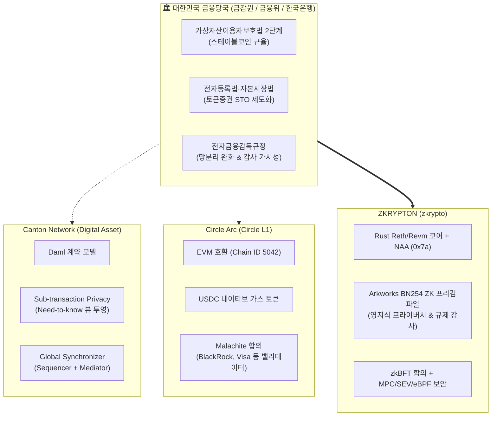

# 🏛️ 금융 인프라 블록체인 심층 분석 WIKI
## Canton Network · Circle Arc · ZKRYPTON & 금융당국 규제 분석 허브

본 위키는 **금융감독원, 금융위원회, 한국은행** 등 국내 금융당국이 주목하고 있는 글로벌 차세대 기관용 금융 블록체인 인프라(**Canton Network**, **Circle Arc**)의 기술 아키텍처와 규제 준수성을 심층 분석하고, 지크립토(zkrypto)의 차세대 기관용 블록체인 **ZKRYPTON**의 기술적 차별화 및 제도적 포지셔닝 전략을 체계화한 지식베이스입니다.

---

## 📌 배경 및 리서치 목적

2026년 하반기, 글로벌 및 국내 금융권은 블록체인 기술의 단순 PoC 단계를 넘어 **실제 자본시장 및 제도권 통화 인프라의 블록체인화(On-Chain Institutional Settlement)** 단계에 본격 진입하였습니다.

1. **글로벌 금융 시장의 지각변동**:
   - **Canton Network (Digital Asset)**: DTCC, Euroclear, BNY Mellon, Goldman Sachs 등 글로벌 초대형 금융기관들이 참여하여 프라이버시 보장과 원장 간 원자적 동시결제(Atomic DvP)를 구현하는 상호운용 금융 네트워크로 부상.
   - **Circle Arc (Circle L1)**: 2026년 9월 메인넷을 공식 출시하며, 휘발성 네이티브 토큰 대신 **USDC를 네이티브 가스 토큰**으로 채택하고 BlackRock, Visa, Mastercard, DTCC 등 초대형 금융 컨소시엄을 밸리데이터로 확보하여 '인터넷의 경제 OS'를 표방.
2. **국내 금융당국(금감원·금융위·한국은행)의 정책적 관심 집중**:
   - **토큰증권(STO)**: 분산원장의 법적 효력 인정, 계좌관리기관 인가 요건, 투자자 보호 및 분산원장 기재 요건 법제화.
   - **스테이블코인 및 예금토큰**: 가상자산이용자보호법 2단계(디지털자산기본법), 원화/외화 스테이블코인 규율체계, 한국은행 CBDC 및 아고라(Agora) 프로젝트 연계.
   - **기관 자본시장 인프라 & 금융 망분리**: 전자금융감독규정 개정에 따른 SaaS·클라우드·블록체인 활용 가이드라인, 결제완결성(채무자회생법 특례) 보장.
3. **ZKRYPTON의 전략적 포지셔닝**:
   - Rust Reth/Revm 고성능 EVM 엔진, zkBFT 합의, 네이티브 계정 추상화(NAA), Arkworks 기반 BN254 영지식 증명(ZKP) 프리컴파일을 탑재한 ZKRYPTON이 글로벌 외산 체인 대비 제공할 수 있는 **프라이버시-컴플라이언스 양립 구조**와 **국내 제도권 최적화 전략** 확립.

---

## 🧭 위키 문서 구조 (Wiki Navigation)

```text
wiki/
├── Home.md                                   # [현재 문서] 위키 메인 및 총괄 개요
├── 01_Canton_Network_Deep_Dive.md            # Canton Network 아키텍처 및 기관 금융 생태계 심층 분석
├── 02_Circle_Arc_Chain_Deep_Dive.md          # Circle Arc L1 체인, USDC 가스 모델 및 결제 인프라 심층 분석
├── 03_Regulatory_Compliance_Analysis.md      # 금감원·금융위 3대 핵심 의제(스테이블코인, 자본시장, STO) 규제 분석
├── 04_Comparative_Matrix_and_ZKRYPTON_Strategy.md # 4대 축 비교 매트릭스 및 ZKRYPTON 차별화 전략
├── _Sidebar.md                               # GitHub Wiki 사이드바 네비게이션
└── _Footer.md                                # 위키 공통 푸터
```

### 📑 모듈별 핵심 내용 요약

| 문서 | 핵심 주제 | 대상 체인 / 주체 | 주요 다룸 내용 |
| :--- | :--- | :--- | :--- |
| [**01. Canton Network**](01_Canton_Network_Deep_Dive.md) | 기관용 프라이버시 상호운용 네트워크 | Canton Network (Digital Asset) | • Daml 스마트 컨트랙트 모델<br>• Sub-transaction Privacy (Need-to-know)<br>• Global Synchronizer (Sequencer & Mediator)<br>• 원자적 DvP 및 24/7 담보 이동성 |
| [**02. Circle Arc**](02_Circle_Arc_Chain_Deep_Dive.md) | 스테이블코인 네이티브 L1 결제 인프라 | Circle Arc (Chain ID: 5042) | • USDC 네이티브 가스 토큰 모델<br>• Malachite 합의 및 서브세컨드 확정성<br>• BlackRock, Visa 등 기관 밸리데이터셋<br>• Hashnote USYC 및 CCTP 라우팅 |
| [**03. 금융당국 규제 분석**](03_Regulatory_Compliance_Analysis.md) | 금감원·금융위·한은 규제 프레임워크 | 규제 당국 & 국내 제도 | • **스테이블코인**: 이용자보호법 2단계 및 지급준비금<br>• **기관 자본시장**: 결제완결성, 장외파생/레포, 망분리<br>• **토큰증권(STO)**: 분산원장 요건, 계좌관리기관<br>• **감독 가시성**: 감사 노드 vs 영지식 감사 증명 |
| [**04. 비교 분석 및 전략**](04_Comparative_Matrix_and_ZKRYPTON_Strategy.md) | 종합 비교 매트릭스 및 ZKRYPTON 전략 | Canton vs Arc vs ZKRYPTON | • 4대 축(아키텍처, 프라이버시/암호학, 규제, 상호운용성) 매트릭스<br>• ZKRYPTON NAA & Arkworks ZKP 차별화<br>• 삼성SDS 협력 및 국내 금융 컨소시엄 선도 방안 |

---

## 📊 종합 핵심 아키텍처 비교 한눈에 보기



---

## 👥 대상 독자 및 활용 가이드
- **사내 엔지니어링 & 연구진**: Canton의 Daml/동기화 프로토콜 및 Circle Arc의 가스 추상화 메커니즘을 ZKRYPTON의 zkBFT 및 NAA(Type 0x7a) 고도화에 참고.
- **사업개발(BD) & 금융 컨소시엄 기획팀**: 삼성SDS 등 엔터프라이즈 파트너와의 공동 금융 PoC, 은행권 토큰화 예금 및 STO 인프라 제안서 작성 시 벤치마킹 데이터로 활용.
- **대관 및 컴플라이언스 담당자**: 금감원, 금융위 디지털자산TF, 한국은행 CBDC 실증사업단과의 정책 질의 및 규제 샌드박스 신청 시 논리적 근거로 활용.
